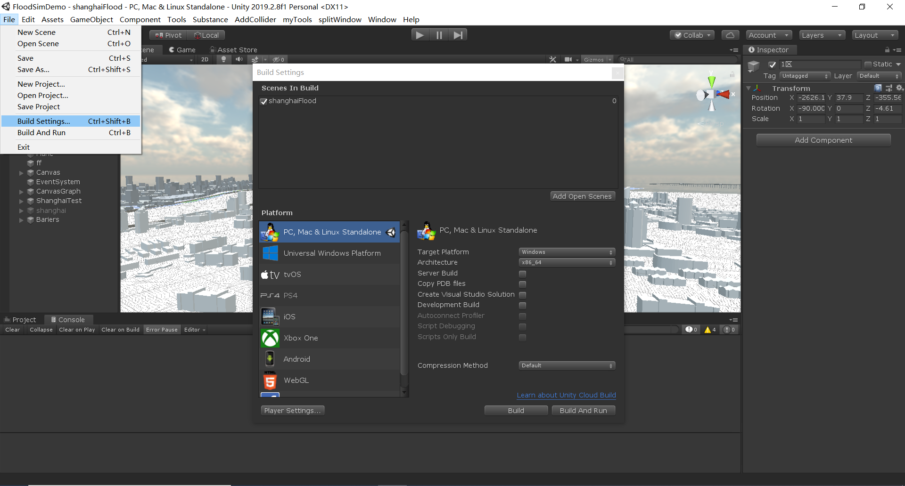
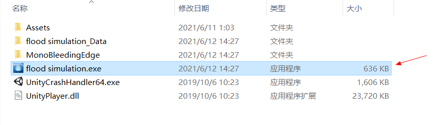
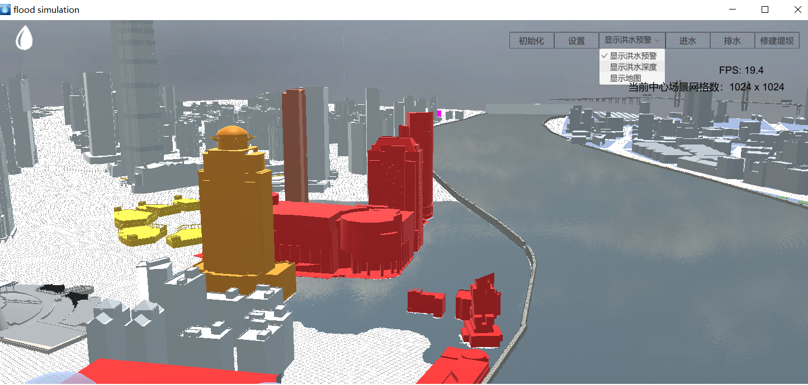
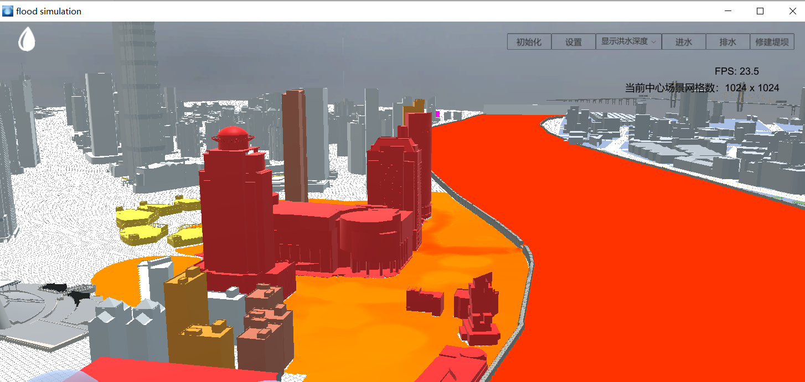
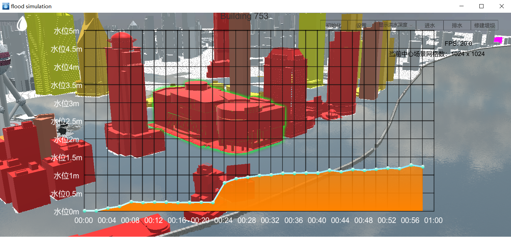
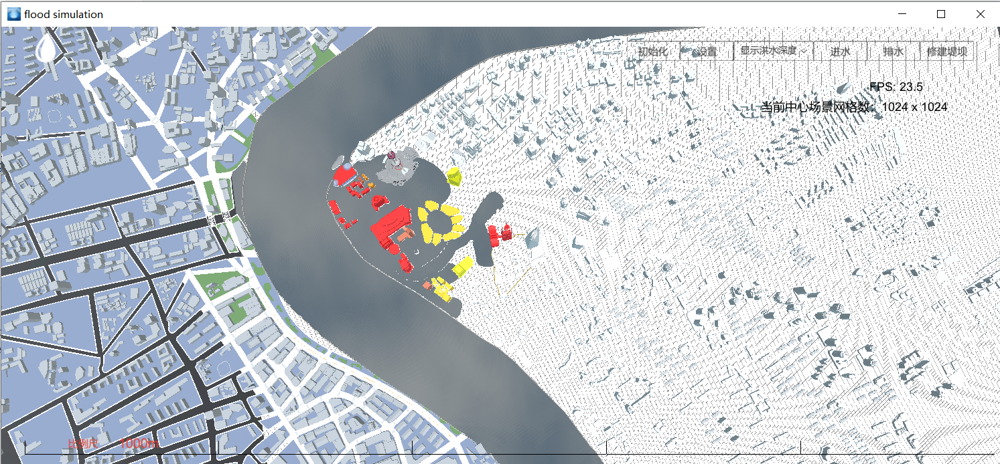

# PhysIKA_Flood_Sim_Unity
Flood simulation with PhysIKA and Unity as backend

#环境依赖

##软件

* cmake
* Visual Studio
* PhysIKA
* Unity版本64位2019.2.8f1

##硬件

* 32GB内存及以上为佳

#编译dll

##编译PhysIKA SWE计算核心Dll

* 使用git clone --recursive url命令下载PhysIKA dev部分代码
* 运行replaceFiles.bat脚本替换对应文件
* 使用cmake编译，生成
* 打开PhysIKA编译生成后的解决方案，找到Examples\App_SWEDll，生成->生成解决方案

##编译Unity项目

* 下载Unity2019.2.8f1
* 下载Untiy工程代码
* 到(PhysIKA build 目录)\bin\Debug下找到App_SWEDlld.dll，复制粘贴至(Unity工程目录)\Assets\Plugins目录下
* 将(PhysIKA 源代码目录)\Examples\App_SWE 下的png图片全部复制粘贴至(Unity工程目录)\Assets\Plugins目录下
* 若PhysIKA编译失败，以上两步也可跳过，工程里有现成编译好的PhysIKA SWE dll

#操作指南

* 启动shanghaiFlood.unity，工程准备就绪后从File->Build Settings打开Build界面，点击Build，文件夹选择FloodSimDemo/build开始build

  

* Build完成后，点击运行FloodSimDemo/AddBasicFiles.bat（将图片和Dll拷贝至build/Assets/Plugins文件夹下），最终build文件夹应为如下结果，flood simulation.exe为build出的可执行文件。

  

* 双击运行flood simulation.exe，点击右上角初始化，跳出初始化工具栏，点击初始化河流水位和场景，完成初始化。（界面可适当拉升至如下效果）

  

* 初始化后按下鼠标中键开始利用PhysIKA计算核心模拟计算，wasd控制前后左右，鼠标右键控制旋转和方向，画面上方显示洪水预警处可调整显示模式

  

  

* 鼠标左键点击建筑物可查看水位，点击其他位置取消显示

  

* 键盘按下Y建可切换到比例尺视图（测试用），此时比例尺和地图1:1

  

  

