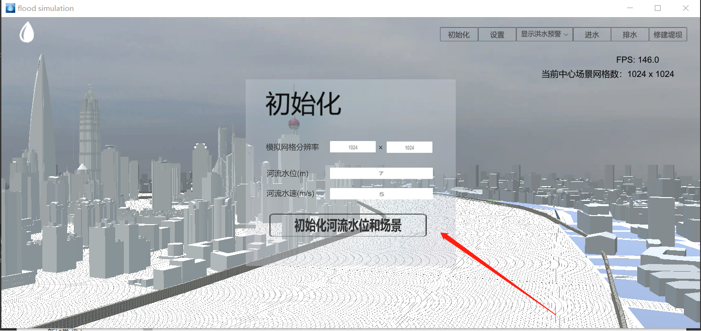

# PhysIKA_Flood_Sim_Unity
Flood simulation with PhysIKA and Unity as backend

# 环境依赖

## 软件

* cmake
* Visual Studio
* PhysIKA
* Unity版本64位2019.2.8f1

## 硬件

* 32GB内存及以上为佳

# 编译dll

## 编译PhysIKA SWE计算核心Dll

* 使用git clone --recursive url命令下载PhysIKA dev部分代码
* 运行replaceFiles.bat脚本替换对应文件
* 使用cmake编译，生成
* 打开PhysIKA编译生成后的解决方案，找到Examples\App_SWEDll，生成->生成解决方案

## 编译Unity项目

* 下载Unity2019.2.8f1

* 下载Untiy工程代码
* 到(PhysIKA build 目录)\bin\Debug下找到App_SWEDlld.dll，复制粘贴至(Unity工程目录)\Assets\Plugins目录下
* 将(PhysIKA 源代码目录)\Examples\App_SWE 下的png图片全部复制粘贴至(Unity工程目录)\Assets\Plugins目录下

# 操作指南

* 启动shanghaiFlood.unity，等待4-5分钟，此时应自动暂停

  

* 找到Untiy上方Tools->interactiveWindow，调出初始化交互面板，按照预设值在初始化操作下点开始模拟按钮，点两次暂停键game窗口即可解锁，然后点击鼠标中键开始仿真

  

* wasd控制前后左右，鼠标右键控制旋转和方向，画面上方显示洪水预警处可调整显示模式

  

* 鼠标左键点击建筑物可查看水位，点击其他位置取消显示

  

  

  
